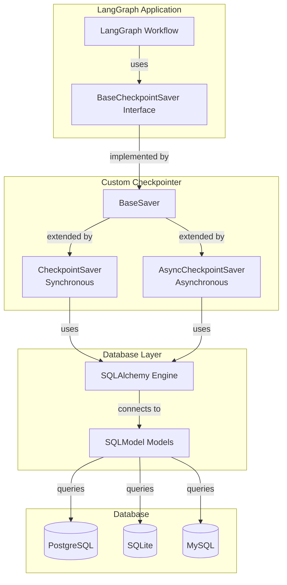
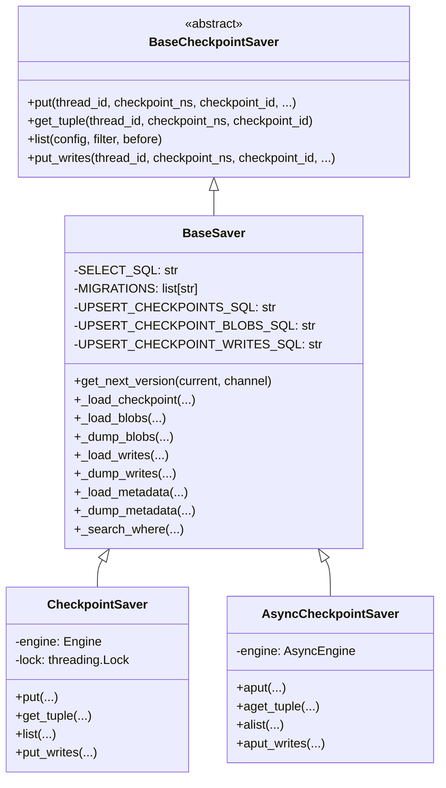
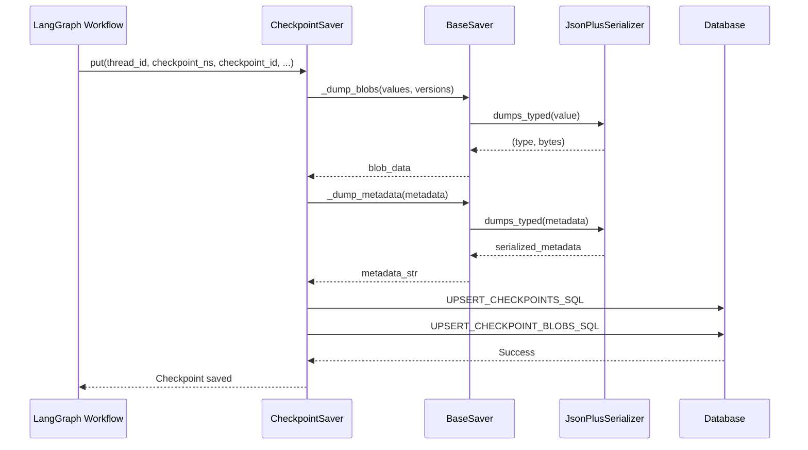
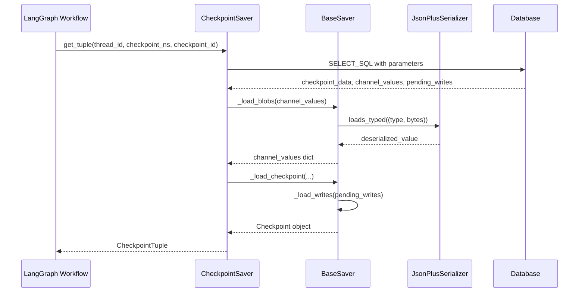
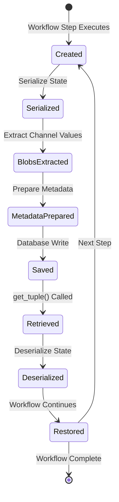
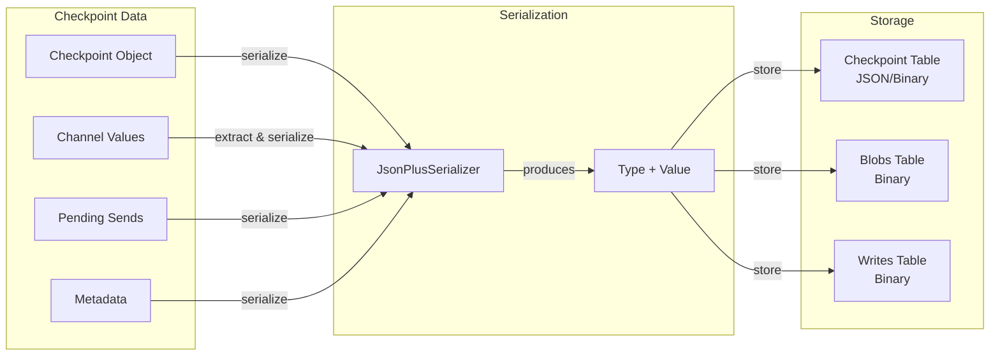
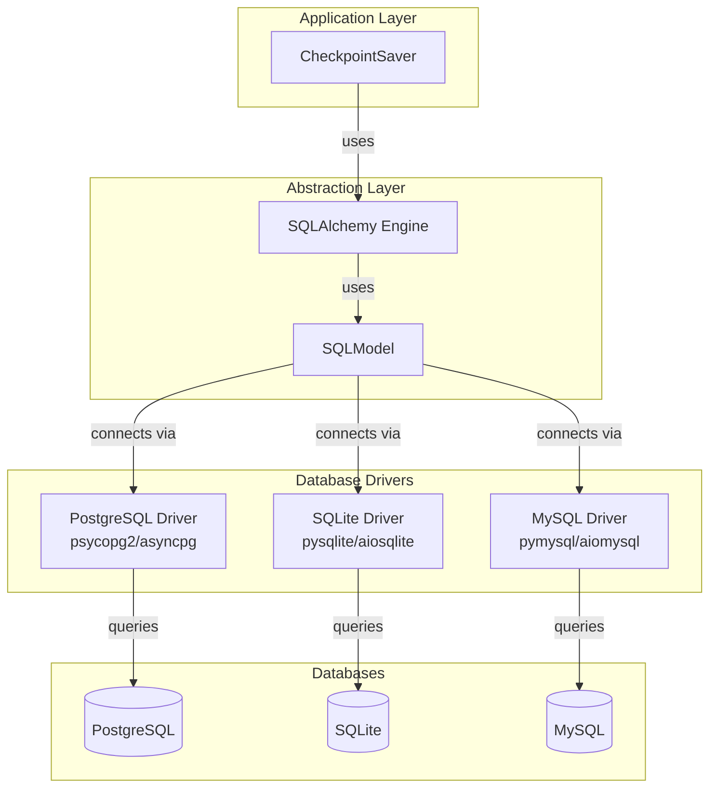

<!--
 Copyright (c) 2025 Victor I. Afolabi

 This software is released under the MIT License.
 https://opensource.org/licenses/MIT
-->

# Architecture Guide

> [!WARNING]
> *The architecture is under active development. This document may change as new
> features are added.*

This document provides a comprehensive overview of the Custom Checkpointer architecture,
design patterns, and component interactions.

## Table of Contents

1. [System Overview](#system-overview)
2. [Component Architecture](#component-architecture)
3. [Data Flow](#data-flow)
4. [Checkpoint Lifecycle](#checkpoint-lifecycle)
5. [Serialization Strategy](#serialization-strategy)
6. [Database Abstraction](#database-abstraction)

## System Overview

The Custom Checkpointer is designed as a flexible persistence layer for LangGraph
workflows. It implements the `BaseCheckpointSaver` interface from LangGraph, providing
both synchronous and asynchronous operations for saving and retrieving workflow state.

## Component Architecture

The checkpointer consists of several key components working together:

### Base Classes

### Core Components

1. **BaseSaver**: Abstract base class providing common functionality
   - SQL query management
   - Serialization/deserialization helpers
   - Version management
   - Metadata handling

2. **CheckpointSaver**: Synchronous implementation
   - Uses SQLAlchemy synchronous engine
   - Thread-safe operations with locks
   - Blocking database operations

3. **AsyncCheckpointSaver**: Asynchronous implementation
   - Uses SQLAlchemy async engine
   - Non-blocking database operations
   - Coroutine-based API

## Data Flow

### Saving a Checkpoint

### Retrieving a Checkpoint

## Checkpoint Lifecycle

A checkpoint goes through several stages during its lifecycle:

### Checkpoint States

1. **Created**: Initial checkpoint object created by LangGraph
2. **Serialized**: State data converted to binary format
3. **BlobsExtracted**: Large channel values extracted as separate blobs
4. **MetadataPrepared**: Metadata serialized and prepared
5. **Saved**: Checkpoint persisted to database
6. **Retrieved**: Checkpoint fetched from database
7. **Deserialized**: Binary data converted back to Python objects
8. **Restored**: State restored in LangGraph workflow

## Serialization Strategy

The checkpointer uses a sophisticated serialization strategy to handle complex
state data:

### Serialization Components

1. **JsonPlusSerializer**: LangGraph's serializer that handles:
   - Python primitives (int, str, float, bool)
   - Complex objects (dicts, lists, tuples)
   - Custom types with type annotations
   - Circular references

2. **Type + Value Pairing**: Each serialized value is paired with its type identifier
to enable proper deserialization

3. **Blob Separation**: Large channel values are stored separately in the `checkpoint_blobs`
table for efficiency

## Database Abstraction

The checkpointer uses SQLAlchemy and SQLModel for database abstraction:

### Database Schema Abstraction

The SQL queries use parameterized placeholders that are compatible across different
databases:

- **PostgreSQL**: Uses `%s` placeholders
- **SQLite**: Uses `?` or `%s` placeholders
- **MySQL**: Uses `%s` placeholders

SQLModel/SQLAlchemy handles the translation of these placeholders based on the
database dialect.

## Error Handling

The checkpointer handles various error scenarios:

- **Connection Errors**: Retry logic for transient failures
- **Constraint Violations**: Handle duplicate checkpoint IDs
- **Serialization Errors**: Graceful handling of unserializable data
- **Database-Specific Errors**: Dialect-aware error handling

## Performance Considerations

1. **Blob Storage**: Large channel values are stored separately to avoid bloating
the main checkpoint table
2. **Indexing**: Primary keys and indexes on frequently queried columns
3. **Connection Pooling**: Reuse database connections for better performance
4. **Batch Operations**: Efficient batch inserts/updates for writes
5. **Lazy Loading**: Channel values loaded only when needed
