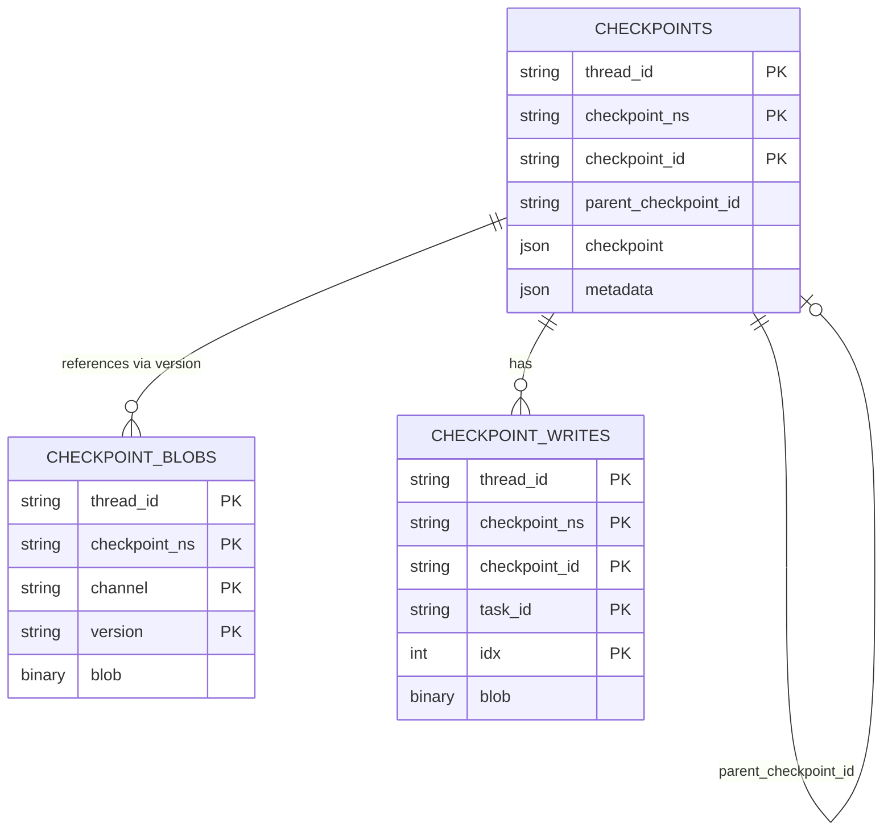

# Database Schema

> [!WARNING]
> *The database schema is under active development. This document may change as new
> features are added.*

Database schema documentation for the Custom Checkpointer.

## Schema Overview

The checkpointer uses a normalized schema with four tables:



## Tables

### LANGGRAPH_CHECKPOINT_MIGRATIONS

Tracks schema migration versions.

```sql
CREATE TABLE LANGGRAPH_CHECKPOINT_MIGRATIONS (
  v INTEGER PRIMARY KEY
);
```

### LANGGRAPH_CHECKPOINTS

Main checkpoint storage table.

```sql
CREATE TABLE LANGGRAPH_CHECKPOINTS (
  thread_id STRING NOT NULL,
  checkpoint_ns STRING NOT NULL DEFAULT '',
  checkpoint_id STRING NOT NULL,
  parent_checkpoint_id STRING,
  type STRING,
  checkpoint JSON NOT NULL,
  metadata JSON NOT NULL DEFAULT '{}',
  PRIMARY KEY (thread_id, checkpoint_ns, checkpoint_id)
);
```

**Columns:**

- `thread_id`: Unique identifier for the conversation/thread
- `checkpoint_ns`: Namespace for checkpoint isolation
- `checkpoint_id`: Unique identifier for this checkpoint
- `parent_checkpoint_id`: Reference to parent checkpoint (for chains)
- `checkpoint`: Serialized checkpoint state (JSON)
- `metadata`: Additional metadata (JSON)

### LANGGRAPH_CHECKPOINT_BLOBS

Stores large channel values separately.

```sql
CREATE TABLE LANGGRAPH_CHECKPOINT_BLOBS (
  thread_id STRING NOT NULL,
  checkpoint_ns STRING NOT NULL DEFAULT '',
  channel STRING NOT NULL,
  version STRING NOT NULL,
  type STRING NOT NULL,
  blob BINARY,
  PRIMARY KEY (thread_id, checkpoint_ns, channel, version)
);
```

**Purpose:** Separate large channel values from main checkpoint table for efficiency.

### LANGGRAPH_CHECKPOINT_WRITES

Stores pending writes (intermediate state changes).

```sql
CREATE TABLE LANGGRAPH_CHECKPOINT_WRITES (
  thread_id STRING NOT NULL,
  checkpoint_ns STRING NOT NULL DEFAULT '',
  checkpoint_id STRING NOT NULL,
  task_id STRING NOT NULL,
  idx INTEGER NOT NULL,
  channel STRING NOT NULL,
  type STRING,
  blob BINARY NOT NULL,
  PRIMARY KEY (thread_id, checkpoint_ns, checkpoint_id, task_id, idx)
);
```

**Purpose:** Stores intermediate writes that haven't been committed to checkpoints
yet.

## Relationships

- **Checkpoint Hierarchy**: Checkpoints can reference parent checkpoints via `parent_checkpoint_id`
- **Checkpoint-Blobs**: Blobs are referenced by channel versions in checkpoint data
- **Checkpoint-Writes**: Writes are associated with specific checkpoints

## Data Types

Database-specific type mappings:

| Generic Type | PostgreSQL | SQLite | MySQL |
|--------------|------------|--------|-------|
| STRING | TEXT | TEXT | VARCHAR(255) |
| INTEGER | INTEGER | INTEGER | INT |
| JSON | JSONB | JSON | JSON |
| BINARY | BYTEA | BLOB | BLOB |

SQLAlchemy handles these mappings automatically based on the database dialect.
